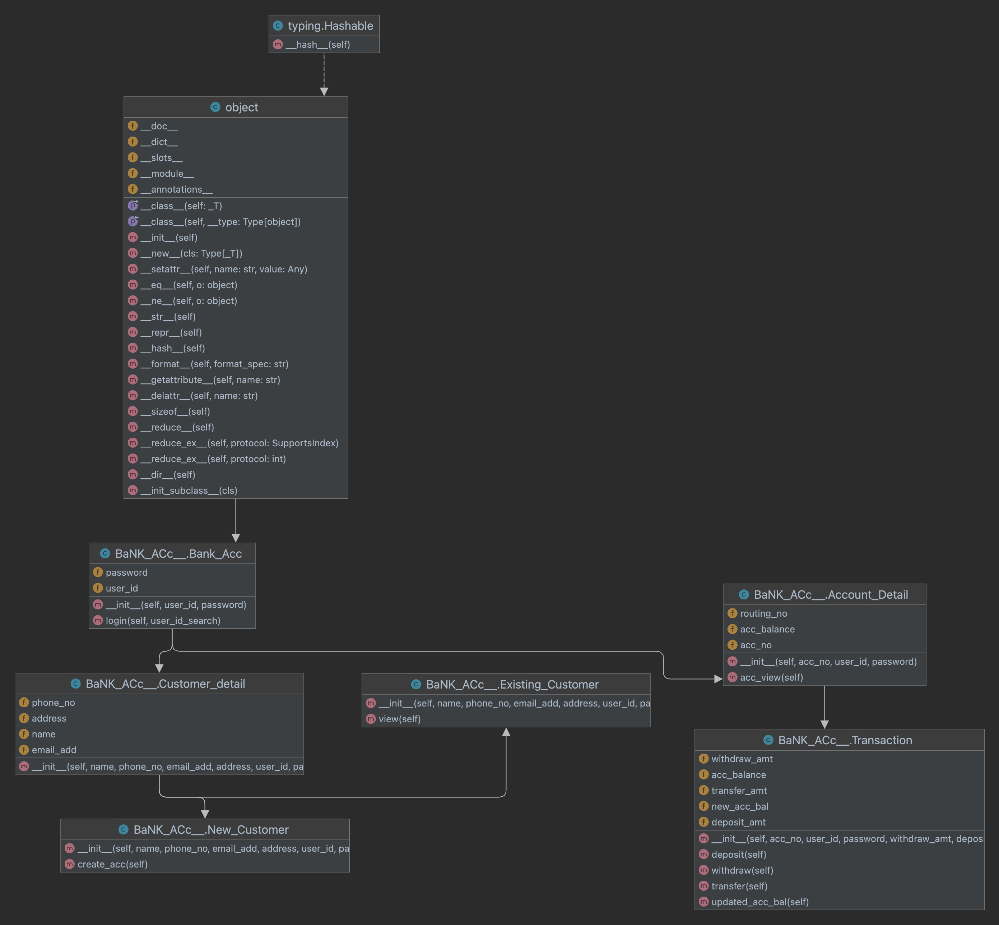

# Bank Account Management System

This project is a Bank Account Management System implemented in Python. The system provides functionalities for creating new customer accounts, viewing account details, handling transactions, and more.

## Overview

The system consists of several classes, each designed to manage different aspects of the bank account operations. Here's a brief overview of the key classes and their roles:

### 1. **BaNK_ACc__Bank_Acc**
   - **Attributes:**
     - `password`: The password associated with the account.
     - `user_id`: The unique identifier for the user.
   - **Methods:**
     - `__init__(self, user_id, password)`: Initializes a new bank account with the given `user_id` and `password`.
     - `login(self, user_id_search)`: Handles user login functionality.

### 2. **BaNK_ACc__Customer_detail**
   - **Attributes:**
     - `phone_no`: The customer's phone number.
     - `address`: The customer's address.
     - `name`: The customer's name.
     - `email_add`: The customer's email address.
   - **Methods:**
     - `__init__(self, name, phone_no, email_add, address, user_id, password)`: Initializes customer details.
   - **Derived Classes:**
     - **BaNK_ACc__New_Customer**: Handles the creation of new customer accounts.
       - `create_acc(self)`: Creates a new account for the customer.
     - **BaNK_ACc__Existing_Customer**: Manages existing customer accounts.
       - `view(self)`: Allows existing customers to view their account details.

### 3. **BaNK_ACc__Account_Detail**
   - **Attributes:**
     - `routing_no`: The routing number associated with the account.
     - `acc_balance`: The current balance of the account.
     - `acc_no`: The account number.
   - **Methods:**
     - `__init__(self, acc_no, user_id, password)`: Initializes account details.
     - `acc_view(self)`: Allows viewing of account details.

### 4. **BaNK_ACc__Transaction**
   - **Attributes:**
     - `withdraw_amt`: Amount to be withdrawn from the account.
     - `transfer_amt`: Amount to be transferred to another account.
     - `new_acc_bal`: The new balance of the account after a transaction.
     - `deposit_amt`: Amount to be deposited into the account.
   - **Methods:**
     - `__init__(self, acc_no, user_id, password, withdraw_amt, deposit_amt)`: Initializes a transaction with the provided details.
     - `deposit(self)`: Handles deposit transactions.
     - `withdraw(self)`: Handles withdrawal transactions.
     - `transfer(self)`: Handles transfer transactions.
     - `updated_acc_bal(self)`: Updates the account balance after a transaction.

## How to Download and Run the Code

### Prerequisites

- **Python 3.x**: Make sure you have Python installed on your system. You can download it from [python.org](https://www.python.org/downloads/).

### Steps to Run

1. **Clone the Repository**:
    ```bash
    git clone https://github.com/your-username/bank_acc_management.git
    cd bank_acc_management
    ```

2. **Run the Application**:
    - Open a terminal or command prompt.
    - Navigate to the directory where you cloned the repository.
    - Run the main script to start the application:
    ```bash
    python main.py
    ```

    The application will start, and you can interact with the various functionalities provided by the Bank Account Management System.

## Features

- **User Authentication**: Secure login using user ID and password.
- **Account Management**: Create new accounts, view account details, and update customer information.
- **Transaction Handling**: Perform deposits, withdrawals, and transfers between accounts.
- **Account Viewing**: View current balance and other account details.

## Class Diagram



This diagram illustrates the relationships between the different classes in the system.

---

You can replace the `https://github.com/your-username/bank_acc_management.git` with the actual URL of your GitHub repository. The diagram image is also referenced assuming it's named `BaNK_ACc__New.png` and is stored in the same directory as the `README.md`.
